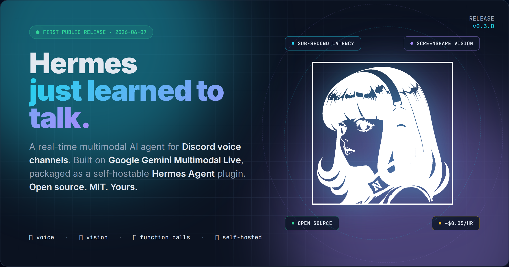

# Hermes Live — Discord Voice Agent



> **Drop a real-time multimodal AI into any Discord voice channel.**
> Full-duplex audio · vision · function calling · multi-CLI delegation · proactive notifications · post-call transcripts.
> Built on **Google Gemini Multimodal Live**, packaged as a self-hostable **Hermes Agent** plugin.
> Open source. MIT. Yours.

---

### Why this changes everything

You've used chatbots. You've used voice assistants that feel like phone trees. **This is neither.**

Hermes Live puts a *genuinely conversational* AI into your Discord voice channel — one that hears you, sees your screen, uses your tools, remembers what you talked about last week, and can spin up a Codex session to fix the bug you just described. Sub-second latency. Hour-long sessions. No SaaS, no relay, no vendor lock-in. Just your gateway, your keys, your hardware.

**What it feels like:**
- You join a voice channel. The agent greets you by name and recalls last week's debugging session.
- You share your screen. It watches, understands, and talks you through the fix in real time.
- You say "ship it" — it delegates to Codex, tracks the PR, and pings you when CI passes.
- You go AFK. It emails you a 3-bucket digest of what happened while you were gone.
- You come back. The conversation picks up exactly where it left off.

This isn't a demo. It's the voice layer your infrastructure has been waiting for.

---

## 📖 [Documentation →](docs-site/index.html)

A proper website is now available in [`docs-site/`](docs-site/index.html) — built from the source markdown in `docs/`. Open `docs-site/index.html` in a browser, or serve it with any static host (`python3 -m http.server` works). 13 pages covering architecture, personality, fallback chain, notifications, email brief, SFX library, webhooks, video feeder, env vars, troubleshooting, and the changelog.

If you prefer raw markdown, every page is also in [`docs/`](docs/).

---

## Quick start — 3 commands, 2 minutes

```bash
# 1. Install
git clone https://github.com/Capslockb/gemini-live-discord-bridge.git
cd gemini-live-discord-bridge
./install.sh                 # full install (prompts for env)
./install.sh --from-local    # use the current working dir
./install.sh --uninstall     # remove

# 2. Restart the gateway
systemctl --user restart hermes-gateway

# 3. From Discord, run:
/voice-live          # join your current voice channel
/voice-live-leave    # leave
```

The installer handles venv, symlinks, env prompts, and SFX directory creation. See `install.sh` for details.

---

## What's in the box — the feature set that ships today

| | |
|---|---|
| 🎙️ **Full-duplex voice** | Sub-second latency, Discord UDP → Opus → 16 kHz mono → Gemini WSS |
| 👁️ **Vision + frame feed** | Send images or stream 1 fps screenshare — the model sees what you see |
| 🛠️ **Function calling** | 30+ voice tools (calendar, mail, Home Assistant, GitHub, Spotify, files, search) |
| 🔁 **Multi-CLI delegation** | `opencode / codex / numasec / gemini / hermes-api` with health registry + automatic fallback |
| 📣 **Proactive notifications** | Voice, DM, channel, webhook, or auto — fires on long-task completion, AFK pings, scheduled alerts |
| 📧 **Email brief** | Scheduled Gmail digest, 3-bucket importance scoring, AFK delivery |
| 😴 **Idle hangup** | Two-phase: prompt after N seconds of silence, then auto-leave |
| 📝 **JSONL transcripts** | Word-level transcripts with tool calls, turns, and idle events |
| 🎵 **Bundled sfx library** | 4 slots (tool-init / error / notification / transition), env-driven paths |
| 🪶 **Self-hostable** | No SaaS, no third-party relay. Runs in your existing Hermes gateway's asyncio loop |
| 🩺 **Health + control API** | Local HTTP on `127.0.0.1:18943` — `/health`, `/frame`, `/say`, `/leave` |

---

## Architecture

```
Discord Voice → Opus Decode → 48kHz PCM → 16kHz Mono → Gemini WSS → Model
     ↑                                                              │
     │                                                              ▼
     └──────────── 24kHz PCM ← Gemini WSS ← 48kHz Stereo ← Discord AudioSource
```

Lies on `discord-ext-voice-recv` (audio RX) and Gemini Multimodal Live API (WSS). The bridge runs **in-process** inside the Hermes gateway — no separate services, no queues, no message buses. Full architecture doc: [`docs/architecture.md`](docs/architecture.md).

---

## Features in depth

| Feature | Doc | What it does |
|---|---|---|
| **Voice I/O** | [`docs/architecture.md`](docs/architecture.md) | Opus in/out, Gemini Live streaming, sidecar HTTP API on 18943 |
| **Personality system** | [`docs/personality.md`](docs/personality.md) | 14-section system prompt, ping-pong rhythm, boredom switch, vocal expression cap |
| **Multi-CLI delegation** | [`docs/fallback-chain.md`](docs/fallback-chain.md) | opencode / codex / gemini / numasec / hermes-api with health registry + automatic fallback |
| **Proactive notifications** | [`docs/notification.md`](docs/notification.md) | `local_notify` tool, scheduler, sidecar `/notify`, AFK DM pings |
| **Email brief** | [`docs/email-brief.md`](docs/email-brief.md) | Scheduled inbox digest, important/fyi/auto buckets, AFK delivery |
| **SFX library** | [`docs/sfx-library.md`](docs/sfx-library.md) | 4 slots, env-driven paths, `local_sfx_test` tool |
| **Webhooks** | [`docs/webhooks.md`](docs/webhooks.md) | 9 event classes, throttle keys, per-class env-var config |
| **Video awareness** | [`docs/architecture.md`](docs/architecture.md) | `/frame` HTTP endpoint, auto-react to video enable/disable |
| **Onboarding** | — | First-run Q&A for new users, persisted to `~/.hermes/voice-users/<id>.yaml` |
| **Honcho context** | — | Per-user peer memory injected into the system prompt |
| **GitHub tools** | — | 6 voice tools to manage repos / issues / PRs via the `gh` CLI |
| **Home Assistant** | — | Voice-driven HA control |
| **Spotify** | — | Play/pause/skip/search/volume via voice |

---

## Why this release matters

Hermes can now **hold a real conversation with you in voice**. Not a 30-second demo — sub-second latency, hour-long sessions, remembers what you talked about last time via Honcho memory.

Mid-conversation, it can:

- 🔍 Search the web and read the answer aloud
- 📁 Open your files, review code, suggest fixes
- 📬 Check your email and summarize
- 🎵 Queue Spotify, dim the lights (Home Assistant)
- 🧠 Delegate and track **Codex / OpenCode / NumaSec / Hermes (API)** sessions
- 👁️ See your screenshare and walk you through a bug

**Built in one session. One developer. Shipped.**

---

## Environment variables

The minimum required:

```bash
DISCORD_BOT_TOKEN=***
GEMINI_API_KEY=***
DISCORD_VOICE_LIVE_USER_ID=1474100257762578597   # your Discord snowflake
```

Full list of every `DISCORD_VOICE_LIVE_*` env var: [`docs/env-vars.md`](docs/env-vars.md).

---

## Sidecar HTTP control API

Runs on `127.0.0.1:18943`:

| Route | Method | Description |
|---|---|---|
| `/health` | GET | Bridge health JSON |
| `/frame` | POST | Send a JPEG/PNG frame (`?force=true` bypasses audio-gate) |
| `/stop` | GET | Stop the bridge |
| `/say` | GET | Inject text into Gemini (`?text=...`) |
| `/notes` | GET | Recent transcript events (`?limit=50`) |
| `/notify` | GET/POST | Proactive notification breakout |

---

## Personality

The system prompt is a 14-section behavioral contract, not documentation. Each section addresses a specific regression. **Do not** add hedging like "be helpful and harmless" — the model interprets that as permission to revert to assistant defaults.

See [`docs/personality.md`](docs/personality.md) for the section index and how to edit.

---

## Cost

~**$0.03–0.06 / hour** of voice on Gemini's Flex tier. Calls cost tokens; a 30-min voice session runs roughly the cost of a long text chat with a generous model.

---

## Documentation

**📖 [Open the docs website →](docs-site/index.html)**

A proper, designed docs site lives in `docs-site/`. It's a static site built from the markdown in `docs/`, so you can host it on GitHub Pages, Vercel, or just `python3 -m http.server` from the repo.

Individual pages (also browseable as raw markdown):

- [`docs/architecture.md`](docs/architecture.md) — end-to-end audio path, threading, lifecycle
- [`docs/personality.md`](docs/personality.md) — system prompt shape and behavioral contracts
- [`docs/fallback-chain.md`](docs/fallback-chain.md) — multi-CLI delegation with health registry
- [`docs/notification.md`](docs/notification.md) — proactive notification breakout
- [`docs/email-brief.md`](docs/email-brief.md) — scheduled inbox digest
- [`docs/sfx-library.md`](docs/sfx-library.md) — slot-based UI sound effects
- [`docs/webhooks.md`](docs/webhooks.md) — event-class webhook fanout
- [`docs/video.md`](docs/video.md) — video frame feeder
- [`docs/env-vars.md`](docs/env-vars.md) — every env var, defaults, descriptions
- [`docs/troubleshooting.md`](docs/troubleshooting.md) — common bridge failures

---

## CHANGELOG

See `CHANGELOG.md` for the full release history.

---

## License

MIT. See top of `bridge.py` for full text.
