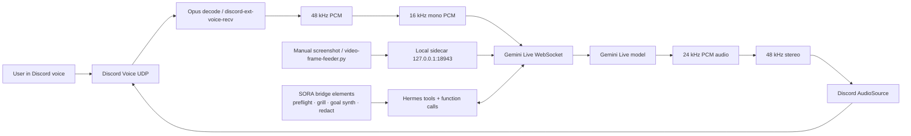

# Hermes Live — Gemini Discord Voice Bridge


> **A self-hosted Discord voice agent powered by Google Gemini Live.**
> Real-time voice · manual image/frame input · function calling · sidecar control API · SORA bridge diagnostics · transcript-to-goal tooling.

[](docs-site/index.html)
[](docs/quickstart.md)
[](docs/architecture.md)
[](docs/sora-bridge-elements.md)
[](docs/release-readiness.md)
[](LICENSE)

---

## What this release is

Hermes Live is the **Gemini transport** for Hermes Discord voice. It joins a Discord voice channel, streams user audio to the Gemini Live API over WebSocket, plays Gemini audio back into Discord, exposes a local sidecar API on `127.0.0.1:18943`, and registers Hermes tools for voice control, frames, notes, diagnostics, and SORA-style goal synthesis.

This README was cross-examined against the current repository state. Claims below are intentionally split into **working**, **partial**, and **research / not bundled** so the public page does not pretend Vapi, Dograh, or MCP support is inside this repo unless the code proves it.

---

## Status map

| Area | Status | Truthful scope |
|---|---:|---|
| Gemini Live Discord voice bridge | **Working** | `voice_live`, `/voice-live`, `/voice-live-leave`, Discord audio RX/TX, Gemini Live WSS |
| Sidecar control API | **Working** | Local `127.0.0.1:18943` routes for health, frames, text injection, notes, notify, stop/leave |
| Manual vision / frame feed | **Working with constraint** | Gemini can receive pushed frames. Discord bots do **not** automatically receive screenshare/camera video; use screenshots or the feeder. |
| Function calling | **Working / backend-dependent** | Voice tools register in Hermes; individual backends such as mail, GitHub, Spotify, Home Assistant, and CLIs depend on local auth/install. |
| SORA bridge elements | **Included** | `sora_bridge_preflight`, `sora_live_grill`, `sora_goal_synth`, `sora_redact` live in `plugin/sora_bridge_elements.py`; run the idempotent patcher if your checkout has not wired them into `plugin/__init__.py`. |
| Docs site | **Updated in this pass** | `docs-site/` mirrors the public story; raw docs remain in `docs/`. |
| Vapi bridge | **Sibling / not bundled here** | This repo may advertise a sibling transport when installed, but the Vapi bridge implementation is not shipped in this repository. |
| MCP server/client mode | **Research target** | No first-class MCP server is bundled here yet. MCP belongs in the roadmap/adapter layer until code and tests exist. |
| Dograh | **Research target** | Treat as an external Vapi-style/MCP-native comparison target, not a shipped integration in this repo. |

---

## Architecture



Raw audio path:

```text
Discord Voice → Opus Decode → 48 kHz PCM → 16 kHz mono → Gemini Live WSS
Gemini Live WSS → 24 kHz PCM → 48 kHz stereo → Discord AudioSource
```

Full architecture: [`docs/architecture.md`](docs/architecture.md).

---

## Quick start

```bash
# 1. Clone
 git clone https://github.com/Capslockb/hermes-live-discord-agent-plugin.git
 cd hermes-live-discord-agent-plugin

# 2. Install
 cd installer
 ./install.py                 # full install, prompts for env
 # or
 ./install.sh --from-local    # use current working tree

# 3. Wire SORA bridge tools if your checkout is not already patched
 cd ..
 python3 installer/enable_sora_bridge_elements.py
 python3 -m py_compile plugin/sora_bridge_elements.py plugin/__init__.py

# 4. Restart Hermes gateway
 systemctl --user restart hermes-gateway

# 5. From Discord
 /voice-live          # join your current voice channel
 /voice-live-leave    # leave
```

Verify locally:

```bash
curl -s http://127.0.0.1:18943/health | python3 -m json.tool
```

If the bridge is not running yet, the health request may fail; that is expected until `/voice-live` has started a session.

---

## SORA bridge elements

The second-release work pulls proven SORA-style operator helpers into the Gemini bridge layer:

| Tool | Purpose |
|---|---|
| `sora_bridge_preflight` | Local diagnostics for Gemini env/model, Honcho config paths, sidecar health, notes dir, and active bridge registry |
| `sora_live_grill` | Cross-examines a transcript/call and extracts missing objective, constraints, owner, risk, next command, and verification test |
| `sora_goal_synth` | Produces Discord-safe `/goal` and ranked `/subgoal` blocks for weaker autonomous models |
| `sora_redact` | Redacts bearer tokens, API keys, JWTs, Pocket keys, Discord webhooks, and GitHub tokens before text enters Gemini/Discord/logs |

SORA docs: [`docs/sora-bridge-elements.md`](docs/sora-bridge-elements.md).

---

## Feature matrix

| Feature | Doc | Notes |
|---|---|---|
| Voice I/O | [`docs/architecture.md`](docs/architecture.md) | Discord audio in/out through Gemini Live WSS |
| Personality system | [`docs/personality.md`](docs/personality.md) | Long system prompt with conversation rhythm and visual-claim guardrails |
| Multi-CLI delegation | [`docs/fallback-chain.md`](docs/fallback-chain.md) | `opencode / codex / gemini / numasec / hermes-api`; depends on local CLIs/auth |
| Proactive notifications | [`docs/notification.md`](docs/notification.md) | `local_notify`, scheduler, sidecar `/notify`, AFK delivery |
| Email brief | [`docs/email-brief.md`](docs/email-brief.md) | Scheduled inbox digest; backend-dependent |
| SFX library | [`docs/sfx-library.md`](docs/sfx-library.md) | Slot-based sound effects with env-driven paths |
| Webhooks | [`docs/webhooks.md`](docs/webhooks.md) | Event fanout and throttle configuration |
| Video/frame input | [`docs/video.md`](docs/video.md) | Manual frame feeder; no automatic Discord screenshare ingestion |
| SORA bridge helpers | [`docs/sora-bridge-elements.md`](docs/sora-bridge-elements.md) | Preflight, grill, goal synthesis, redaction |
| Release truth table | [`docs/release-readiness.md`](docs/release-readiness.md) | What is working, partial, planned, or not bundled |

---

## Required environment

```bash
DISCORD_BOT_TOKEN=***
GEMINI_API_KEY=***        # or GOOGLE_API_KEY
DISCORD_VOICE_LIVE_USER_ID=1474100257762578597
```

Useful optional variables:

```bash
DISCORD_VOICE_LIVE_PORT=18943
DISCORD_VOICE_LIVE_VOICE=Kore
GEMINI_MODEL=gemini-3.1-flash-live-preview
GEMINI_LIVE_MODEL_FALLBACKS=gemini-3.1-flash-live-preview,gemini-2.5-flash-native-audio-preview-12-2025,gemini-2.5-flash-native-audio-preview-09-2025
VOICE_LIVE_HONCHO_CONTEXT=true
VOICE_LIVE_HONCHO_PEER=<peer-name>
```

Full env reference: [`docs/env-vars.md`](docs/env-vars.md).

---

## Sidecar HTTP control API

Runs locally on `127.0.0.1:18943` by default.

| Route | Method | Description |
|---|---|---|
| `/health` | GET | Bridge health JSON |
| `/frame` | POST | Send a JPEG/PNG/WebP frame; `?force=true` bypasses audio-gate |
| `/say` | GET | Inject text into Gemini with `?text=...` |
| `/notes` | GET | Recent transcript/note events with `?limit=50` |
| `/notify` | GET/POST | Proactive notification breakout |
| `/stop` / `/leave` | GET | Stop the active bridge |

---

## What this repo does not currently ship

- No bundled Vapi bridge implementation.
- No bundled Dograh bridge implementation.
- No first-class MCP server/client adapter.
- No automatic access to Discord screenshare/camera video streams.
- No public sidecar exposure; sidecar calls are local-first.
- No guarantee that optional backends work without their own local credentials and CLIs.

These are valid follow-up tracks, but they should stay out of “working” claims until code and tests land.

---

## Release verification checklist

```bash
python3 installer/enable_sora_bridge_elements.py
python3 -m py_compile plugin/*.py
systemctl --user restart hermes-gateway
journalctl --user -u hermes-gateway -n 100 --no-pager
curl -s http://127.0.0.1:18943/health | python3 -m json.tool
```

Then from Hermes/Discord, verify:

```text
voice_live_status
voice_live_notes limit=10
sora_bridge_preflight
sora_redact text="Authorization: Bearer fake.fake.fake"
sora_live_grill text="we need to migrate SORA bridge features into Gemini bridge and verify docs"
sora_goal_synth text="we need to migrate SORA bridge features into Gemini bridge and verify docs"
```

---

## Documentation

- [`docs/README.md`](docs/README.md) — raw docs index
- [`docs-site/index.html`](docs-site/index.html) — static docs landing page
- [`docs/architecture.md`](docs/architecture.md) — end-to-end audio path and lifecycle
- [`docs/sora-bridge-elements.md`](docs/sora-bridge-elements.md) — SORA helper tools
- [`docs/release-readiness.md`](docs/release-readiness.md) — cross-exam truth table
- [`CHANGELOG.md`](CHANGELOG.md) — release history

---

## License

MIT. See [`LICENSE`](LICENSE).
