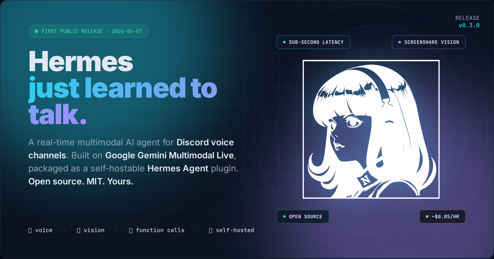

# Hermes Live — Discord Voice Agent



> **Drop a real-time multimodal AI into any Discord voice channel.**
> Full-duplex audio · vision · function calling · multi-CLI delegation · proactive notifications · post-call transcripts.
> Built on **Google Gemini Multimodal Live**, packaged as a self-hostable **Hermes Agent** plugin.
> Source available. Self-hosted. Inspectable.

---

### Why this changes everything

You've used chatbots. You've used voice assistants that feel like phone trees. **This is neither.**

Hermes Live puts a conversational AI into your Discord voice channel — one that hears you, can use configured tools, and can receive bounded Honcho peer context when that integration is available. Latency, memory continuity, and tool delivery depend on the selected providers, network, and optional integrations; the project does not guarantee an exact replay of a previous session. No project-hosted relay is required: it runs in your gateway and connects directly to Discord, Gemini, and any optional integrations using your credentials. Those external services remain subject to their own availability, pricing, and data-handling terms.

**What it feels like:**
- You join a voice channel. When Honcho is configured and a peer representation exists, the agent can receive a bounded set of facts and context about you; it does not load a separate recent-session transcript.
- You describe what is on screen and it talks you through the fix; bundled frame delivery is currently blocked by [Issue #9](https://github.com/Capslockb/hermes-live-discord-agent-plugin/issues/9).
- You ask it to delegate through Codex or another configured CLI. Automated follow-up and proactive delivery are best-effort and remain subject to [Issues #13](https://github.com/Capslockb/hermes-live-discord-agent-plugin/issues/13), [#14](https://github.com/Capslockb/hermes-live-discord-agent-plugin/issues/14), and [#17](https://github.com/Capslockb/hermes-live-discord-agent-plugin/issues/17).
- You request an email brief. It can build the three-bucket summary, but backend-state, retry/de-duplication, privacy, and recipient-routing defects remain open in [Issue #12](https://github.com/Capslockb/hermes-live-discord-agent-plugin/issues/12).
- You reconnect later. Any continuity comes from the current configured context sources; the prior voice session is not resumed verbatim.

This is a working self-hosted integration, not a claim that every optional path is production-ready. Current limitations are linked below.

---

## 📖 Documentation

The generated static site in [`docs-site/`](docs-site/index.html) is currently stale and still contains pre-correction repository-identity, licensing, and capability wording. Treat the Markdown under [`docs/`](docs/) and this README as canonical until the generator and regeneration work in [Issue #6](https://github.com/Capslockb/hermes-live-discord-agent-plugin/issues/6) is complete. The static site may still be opened locally for layout preview, but it should not be published as authoritative documentation yet.

---

## Quick start — local checkout

```bash
# 1. Install this checkout
git clone https://github.com/Capslockb/hermes-live-discord-agent-plugin.git
cd hermes-live-discord-agent-plugin
./install.sh --from-local    # link this checkout into Hermes and prompt for env

# 2. Restart the gateway
systemctl --user restart hermes-gateway

# 3. From Discord, run:
/voice-live          # join your current voice channel
/voice-live-leave    # leave
```

After cloning, use `--from-local`. Plain `./install.sh` ignores the current checkout and uses the installer's configured remote clone target; correction of that executable path is under review in [PR #7](https://github.com/Capslockb/hermes-live-discord-agent-plugin/pull/7). To remove the installation later, run `./install.sh --uninstall` from the checkout.

The installer handles the Hermes venv, dependency installation, environment prompts, and SFX directory creation. `--from-local` links the current checkout into Hermes; remote mode clones into the plugin directory instead. The `DISCORD_VOICE_LIVE_USER_ID` prompt can currently be skipped and `VOICE_OWNER_DISCORD_ID` is not prompted at all, so configure both explicitly for a normal single-owner setup; see [Issue #18](https://github.com/Capslockb/hermes-live-discord-agent-plugin/issues/18).

---

## What's in the box — the feature set that ships today

| | |
|---|---|
| 🎙️ **Full-duplex voice** | Sub-second latency, Discord UDP → Opus → 16 kHz mono → Gemini WSS |
| 👁️ **Vision + frame feed** | The frame endpoint and feeder are present, but both bundled client paths are blocked on current `main` by [Issue #9](https://github.com/Capslockb/hermes-live-discord-agent-plugin/issues/9). |
| 🛠️ **Function calling** | 30+ voice tools (calendar, mail, Home Assistant, GitHub, Spotify, files, search) |
| 🔁 **Multi-CLI delegation** | `opencode / codex / numasec / gemini / hermes-api` with health registry + automatic fallback |
| 📣 **Proactive notifications** | Six modes: voice, DM, channel, webhook, `auto`, and `all`. Delivery is best-effort; scheduled persistence/retry and the internal `/notify` fallback remain blocked by [Issues #13](https://github.com/Capslockb/hermes-live-discord-agent-plugin/issues/13), [#14](https://github.com/Capslockb/hermes-live-discord-agent-plugin/issues/14), and [#17](https://github.com/Capslockb/hermes-live-discord-agent-plugin/issues/17). |
| 📧 **Email brief** | **Partial:** builds a three-bucket inbox summary, but backend failure can look like an empty inbox, failed delivery can consume de-duplication state, and recipient/privacy boundaries remain open in [Issue #12](https://github.com/Capslockb/hermes-live-discord-agent-plugin/issues/12). |
| 😴 **Idle hangup** | Two-phase: prompt after N seconds of silence, then auto-leave |
| 📝 **JSONL transcripts** | Word-level transcripts with tool calls, turns, and idle events |
| 🎵 **Bundled sfx library** | 4 slots (tool-init / error / notification / transition), env-driven paths |
| 🪶 **Self-hosted bridge** | Runs in your existing Hermes gateway's asyncio loop; Discord, Gemini, and optional integrations remain external services |
| 🩺 **Health + control API** | Local HTTP on `127.0.0.1:18943` — `/health`, `/notes`, `/frame`, `/say`, `/stop`, and `/notify`; mutating routes require `X-API-Secret`. |

---

## Architecture

```
Discord Voice → Opus Decode → 48kHz PCM → 16kHz Mono → Gemini WSS → Model
     ↑                                                              │
     │                                                              ▼
     └──────────── 24kHz PCM ← Gemini WSS ← 48kHz Stereo ← Discord AudioSource
```

Relies on `discord-ext-voice-recv` (audio RX) and Gemini Multimodal Live API (WSS). The bridge runs **in-process** inside the Hermes gateway — no separate services, no queues, no message buses. Full architecture doc: [`docs/architecture.md`](docs/architecture.md).

---

## Features in depth

| Feature | Doc | What it does |
|---|---|---|
| **Voice I/O** | [`docs/architecture.md`](docs/architecture.md) | Opus in/out, Gemini Live streaming, sidecar HTTP API on 18943 |
| **Personality system** | [`docs/personality.md`](docs/personality.md) | 14-section system prompt, ping-pong rhythm, boredom switch, vocal expression cap |
| **Multi-CLI delegation** | [`docs/fallback-chain.md`](docs/fallback-chain.md) | opencode / codex / gemini / numasec / hermes-api with health registry + automatic fallback |
| **Proactive notifications** | [`docs/notification.md`](docs/notification.md) | `local_notify` tool, scheduler, sidecar `/notify`, AFK DM pings |
| **Email brief** | [`docs/email-brief.md`](docs/email-brief.md) | Scheduled inbox digest, important/fyi/auto buckets, AFK delivery |
| **SFX library** | [`docs/sfx-library.md`](docs/sfx-library.md) | 4 slots, env-driven paths, `local_sfx_test` tool |
| **Webhooks** | [`docs/webhooks.md`](docs/webhooks.md) | 9 event classes, throttle keys, per-class env-var config |
| **Video awareness** | [`docs/video.md`](docs/video.md) | `/frame` route and video-state plumbing; bundled clients remain blocked by Issue #9 |
| **Onboarding** | — | First-run Q&A for new users, persisted to `~/.hermes/voice-users/<id>.yaml` |
| **Honcho context** | — | Per-user peer memory injected into the system prompt |
| **GitHub tools** | — | 6 voice tools to manage repos / issues / PRs via the `gh` CLI |
| **Home Assistant** | — | Voice-driven HA control |
| **Spotify** | — | Play/pause/skip/search/volume via voice |

---

## Why this release matters

Hermes can hold a real conversation with you in voice. Latency and session duration depend on the provider and network. When Honcho is configured and available, each session can receive a bounded peer representation and card conclusions; it does not automatically restore a prior session transcript.

Mid-conversation, it can:

- 🔍 Search the web and read the answer aloud
- 📁 Open your files, review code, suggest fixes
- 📬 Check your email and summarize
- 🎵 Queue Spotify, dim the lights (Home Assistant)
- 🧠 Delegate and track **Codex / OpenCode / NumaSec / Hermes (API)** sessions

Current frame delivery is tracked separately in [Issue #9](https://github.com/Capslockb/hermes-live-discord-agent-plugin/issues/9) and should not be treated as an operational release capability yet.

**Built in one session. One developer. Shipped.**

---

## Environment variables

Minimum for normal single-user operation:

```bash
DISCORD_BOT_TOKEN=***
GEMINI_API_KEY=***
DISCORD_VOICE_LIVE_USER_ID=<your-discord-snowflake>
```

For owner-only profile tools, also configure:

```bash
VOICE_OWNER_DISCORD_ID=<your-discord-snowflake>
```

Set both identity values explicitly. Current executable fallbacks can otherwise infer, authorize, or route to a repository-embedded account; removal and migration are tracked in [Issue #18](https://github.com/Capslockb/hermes-live-discord-agent-plugin/issues/18).

Full list of every environment variable: [`docs/env-vars.md`](docs/env-vars.md).

---

## Sidecar HTTP control API

Runs on `127.0.0.1:18943`. Keep this port loopback-only. `/health` and `/notes` are anonymous read-only routes; `/notes` can return stored transcript content. `/frame`, `/stop`, `/say`, and `/notify` are mutating routes and require `X-API-Secret`. Current secret-file safety and lifecycle are unresolved in [Issue #17](https://github.com/Capslockb/hermes-live-discord-agent-plugin/issues/17), and the built-in `/notify` fallback cannot yet authenticate under [Issue #14](https://github.com/Capslockb/hermes-live-discord-agent-plugin/issues/14).

| Route | Method | Description |
|---|---|---|
| `/health` | GET | Anonymous bridge health JSON on loopback |
| `/frame` | POST | Authenticated JPEG/PNG frame input (`?force=true` bypasses the audio gate); bundled clients are currently blocked by Issue #9 |
| `/stop` | GET | Authenticated bridge stop |
| `/say` | GET | Authenticated text injection into Gemini (`?text=...`) |
| `/notes` | GET | Anonymous recent transcript events (`?limit=50`) on loopback |
| `/notify` | GET/POST | Authenticated proactive notification breakout; built-in fallback blocked by Issues #14 and #17 |

---

## Personality

The system prompt is a 14-section behavioral contract, not documentation. Each section addresses a specific regression. **Do not** add hedging like "be helpful and harmless" — the model interprets that as permission to revert to assistant defaults.

See [`docs/personality.md`](docs/personality.md) for the section index and how to edit.

---

## Cost

Gemini Live usage is billed according to the selected model or service tier and current provider pricing. Session duration, audio and vision volume, context size, and tool use can affect cost; optional integrations may charge separately. Check current provider pricing before deployment.

---

## Documentation

The authoritative documentation is the Markdown under [`docs/`](docs/) plus this README. The generated `docs-site/` copy currently trails those corrections and still includes stale repository-identity, licensing, and capability text. Do not publish it as canonical until [Issue #6](https://github.com/Capslockb/hermes-live-discord-agent-plugin/issues/6) regenerates it from corrected sources and validates drift.

Individual pages:

- [`docs/architecture.md`](docs/architecture.md) — end-to-end audio path, threading, lifecycle
- [`docs/personality.md`](docs/personality.md) — system prompt shape and behavioral contracts
- [`docs/fallback-chain.md`](docs/fallback-chain.md) — multi-CLI delegation with health registry
- [`docs/notification.md`](docs/notification.md) — proactive notification breakout
- [`docs/email-brief.md`](docs/email-brief.md) — scheduled inbox digest
- [`docs/sfx-library.md`](docs/sfx-library.md) — slot-based UI sound effects
- [`docs/webhooks.md`](docs/webhooks.md) — event-class webhook fanout
- [`docs/video.md`](docs/video.md) — video frame feeder
- [`docs/env-vars.md`](docs/env-vars.md) — every env var, defaults, descriptions
- [`docs/troubleshooting.md`](docs/troubleshooting.md) — common bridge failures

---

## CHANGELOG

See `CHANGELOG.md` for the full release history.

---

## License

No standalone `LICENSE` file is currently included. Until the repository owner adds one, do not assume reuse or redistribution rights from README wording alone.
