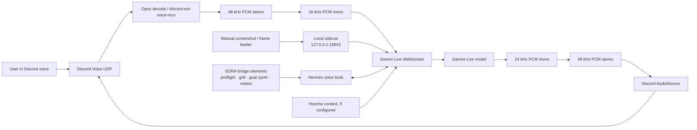

# Architecture

End-to-end audio path, sidecar flow, SORA helper layer, and lifecycle of the Gemini Live Discord voice bridge.

## System map



## Audio path

```text
Discord Voice (Opus)
    ↓ discord-ext-voice-recv decode
48 kHz PCM stereo (16-bit)
    ↓ VoiceListener / downsample
16 kHz PCM mono
    ↓ Gemini Live WebSocket input
Gemini Live API
    ↓ Gemini Live WebSocket output
24 kHz PCM mono (PCM16)
    ↓ LiveAudioSource / upsample
48 kHz PCM stereo
    ↓ Discord AudioSource
Discord Voice (Opus encode)
```

The important correction: input to Gemini is 16 kHz mono PCM; output from Gemini is 24 kHz mono PCM; Discord playback is 48 kHz stereo.

## Sidecar path

The sidecar is local-first. It is meant for the plugin, the frame feeder, and local diagnostics, not for public internet traffic.

| Route | Purpose |
|---|---|
| `GET /health` | Bridge health, metrics, connection state |
| `POST /frame` | Push a JPEG/PNG/WebP frame into Gemini Live |
| `GET /say?text=...` | Inject text into the live Gemini session |
| `GET /notes?limit=50` | Read recent notes/transcript events |
| `GET/POST /notify` | Trigger notification breakout |
| `GET /stop` / `GET /leave` | Stop the active bridge |

## SORA helper layer

SORA bridge elements live next to the Gemini bridge; they do not create another transport.

```text
Transcript / live call notes
        ↓
sora_redact          → strips tokens/webhooks/JWTs before reuse
        ↓
sora_live_grill      → forces objective, constraints, owner, risk, next command, verification test
        ↓
sora_goal_synth      → emits Discord-safe /goal and /subgoal blocks
        ↓
weaker model / autonomous agent / Discord operator handoff
```

`SORA bridge elements` should be described as included helper tools, not as Vapi, Dograh, or MCP support.

## Threading model

The bridge runs inside the Hermes gateway process and uses a mix of asyncio tasks, Discord audio threads, and small scheduler threads.

| Runtime area | Owner | Purpose |
|---|---|---|
| **Gateway event loop** | `discord.py` / Hermes gateway | Owns the bot, voice client, slash commands, and async plugin lifecycle. |
| **Discord audio source thread** | `discord.py` native audio playback | Calls `AudioSource.read()`; audio queues must remain thread-safe. |
| **Gemini receive loop** | `GeminiLiveBridge._ws_recv_loop` | Reads WSS frames and dispatches audio, tool calls, transcripts, and state events. |
| **Tool worker path** | `_run_local_tool` and Hermes handlers | Runs tool calls, often through executor paths for blocking work. |
| **Schedulers** | notification/email subsystems | Poll or schedule notifications, briefs, and AFK delivery. |

## Lifecycle

1. User joins a Discord voice channel.
2. User runs `/voice-live`.
3. `plugin/__init__.py:voice_live()` checks the user/target voice channel, cleans stale active bridge state, and refuses to start if the target user is not present.
4. The plugin loads the user profile/Honcho mapping if available.
5. `bridge.py` starts the sidecar and Gemini Live session.
6. Discord audio is decoded to PCM, downsampled to 16 kHz mono, and streamed to Gemini Live.
7. Gemini Live audio is received as 24 kHz PCM, upsampled to 48 kHz stereo, and played back through Discord.
8. Manual frames can be pushed through `/frame` or `voice_live_frame`.
9. SORA helpers can preflight, redact, grill transcripts, and synthesize `/goal`/`/subgoal` blocks.
10. User runs `/voice-live-leave`, or the bridge stops through watchdog/idle/sidecar stop.

## Key files

| File | Role |
|---|---|
| `plugin/__init__.py` | Hermes plugin entry. Registers voice tools, slash commands, autostart, local frame/status handlers. |
| `plugin/bridge.py` | Core Gemini/Discord bridge: audio I/O, Gemini Live WSS, tool-call handling, sidecar server. |
| `plugin/sora_bridge_elements.py` | SORA helper tools: preflight, Live Grill Mode, goal synthesis, redaction. |
| `installer/enable_sora_bridge_elements.py` | Idempotent patcher for wiring SORA tools into the plugin entrypoint. |
| `plugin/plugin.yaml` | Plugin metadata and advertised Hermes tools. |
| `plugin/notification.py` | Multi-channel proactive notification dispatcher. |
| `plugin/email_brief.py` | Scheduled/on-demand inbox digest. |
| `plugin/sfx.py` | Slot-based UI sound effects library. |
| `plugin/delegation_agent.py` | Multi-CLI delegation and fallback chain. |
| `plugin/user_profiles.py` | Per-user profile and Honcho peer mapping. |
| `plugin/webhook_dispatcher.py` | Event-class webhook fanout. |

## Key env vars

Full list: [`env-vars.md`](env-vars.md).

| Env var | Purpose |
|---|---|
| `DISCORD_BOT_TOKEN` | Discord bot auth. |
| `GEMINI_API_KEY` / `GOOGLE_API_KEY` | Gemini API auth. |
| `DISCORD_VOICE_LIVE_USER_ID` | Default target Discord user. |
| `DISCORD_VOICE_LIVE_PORT` | Local sidecar HTTP port, default `18943`. |
| `DISCORD_VOICE_LIVE_VOICE` | Gemini Live voice name, default `Kore`. |
| `GEMINI_MODEL` | Primary Gemini Live model. |
| `GEMINI_LIVE_MODEL_FALLBACKS` | Comma-separated fallback models. |
| `VOICE_LIVE_HONCHO_CONTEXT` | Enable/disable Honcho context injection. |
| `VOICE_LIVE_HONCHO_PEER` | Optional Honcho peer override. |

## Integration boundaries

| System | Boundary |
|---|---|
| Gemini Live | Primary transport in this repository. |
| SORA | Helper layer imported into Gemini bridge; not a replacement transport. |
| Vapi | Sibling transport if installed elsewhere; not bundled here. |
| MCP | Research/adapter target; no first-class MCP server/client in this repo yet. |
| Dograh | External comparison/integration target; not bundled here. |
